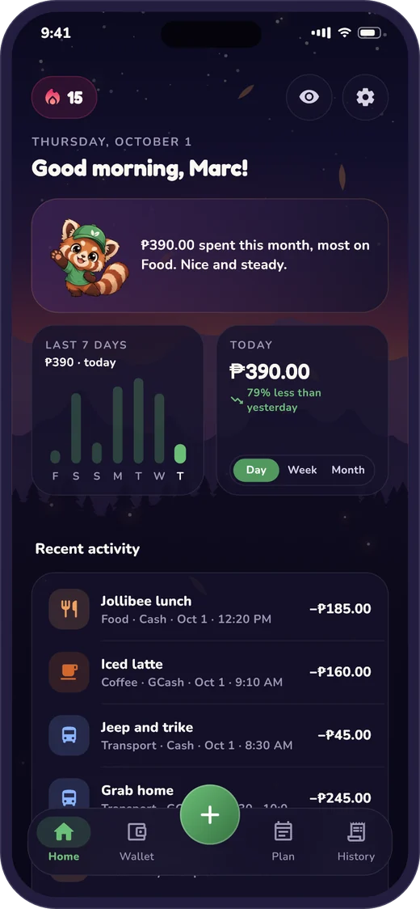
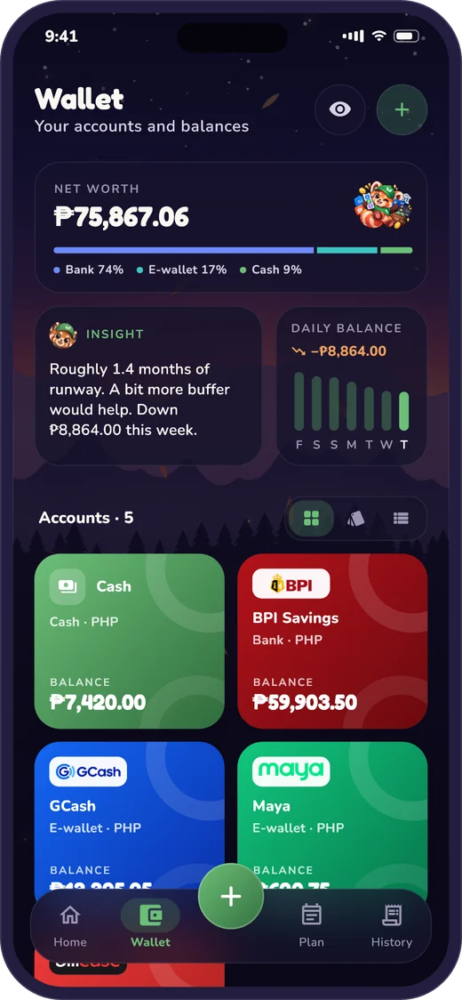
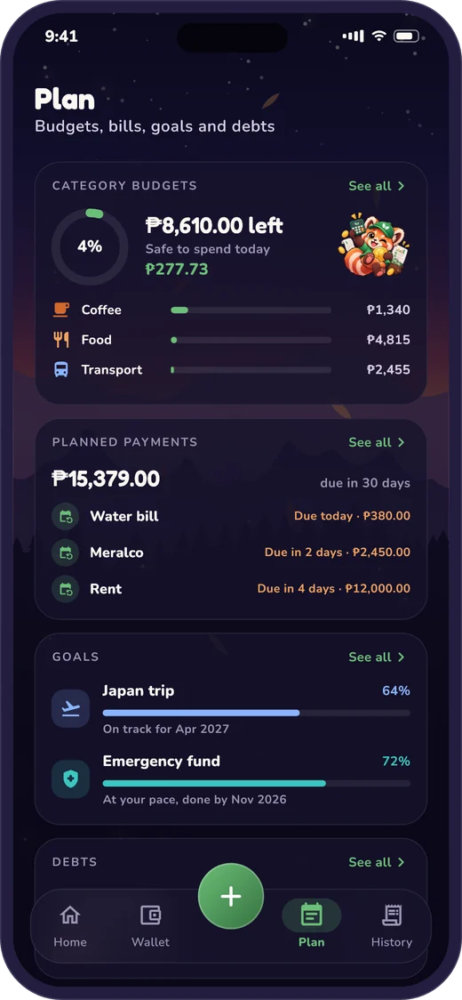
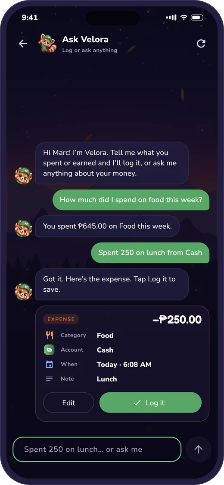
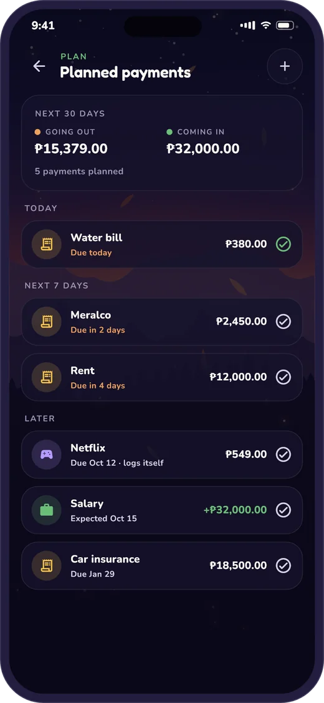
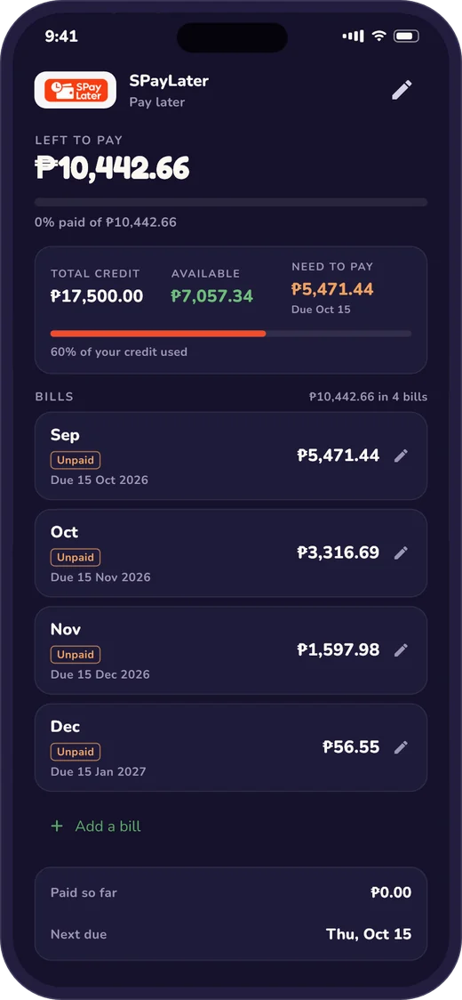
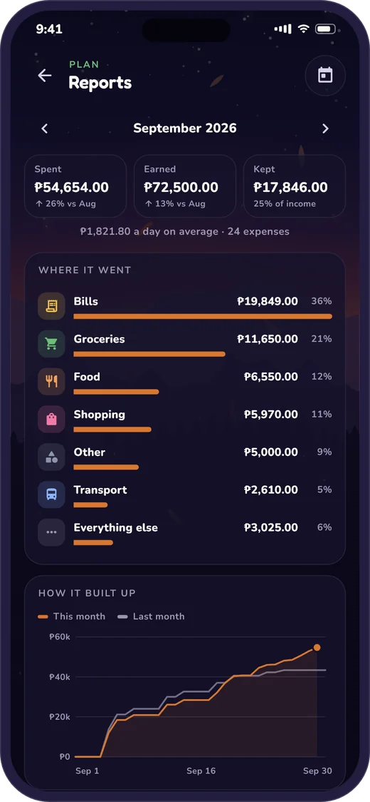
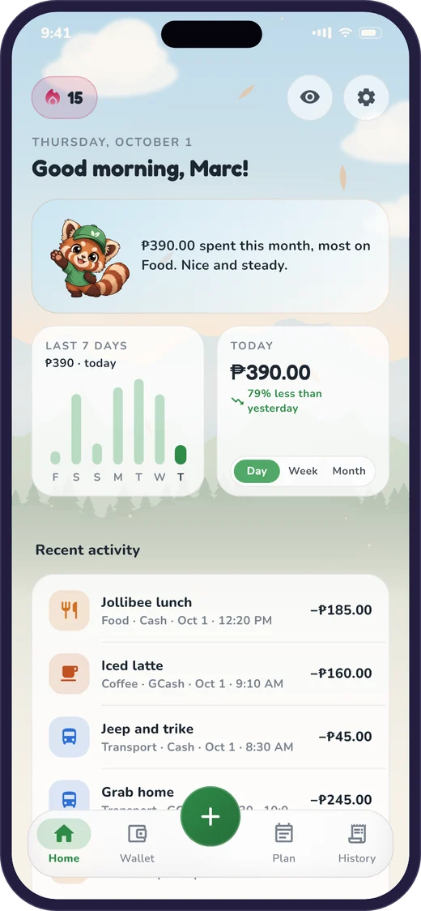
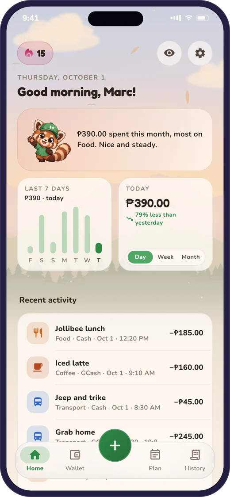

<p align="center">
  
</p>

<h1 align="center">Velora</h1>

<p align="center">
  <b>A calm, friendly money companion for everyday life in the Philippines.</b><br />
  Log spending in seconds, pay bills on time and watch debts reach zero,<br />
  with Velora the red panda cheering you on.
</p>

<p align="center">
  
  
  
  
  
</p>

<p align="center">
  
  
  
  
</p>

<br />

## What Velora does

<table>
  <tr>
    <td align="center" width="33%">
      <br />
      <b>Log in seconds</b><br />
      <sub>A calculator pad, a receipt scan, or just type <i>"spent 250 on lunch"</i>.</sub>
    </td>
    <td align="center" width="33%">
      <br />
      <b>Every account</b><br />
      <sub>Cash, banks, GCash, Maya, MariBank, SPayLater, BillEase, and Payoneer in dollars.</sub>
    </td>
    <td align="center" width="33%">
      <br />
      <b>Budgets that guide</b><br />
      <sub>Category budgets and a “safe to spend today” number.</sub>
    </td>
  </tr>
  <tr>
    <td align="center">
      <br />
      <b>Bills, never missed</b><br />
      <sub>Reminders before they’re due, pay in one tap, or let them log themselves.</sub>
    </td>
    <td align="center">
      <br />
      <b>Debts to zero</b><br />
      <sub>Credit limits, monthly bills and payoff dates for cards, loans and pay-later.</sub>
    </td>
    <td align="center">
      <br />
      <b>Goals on pace</b><br />
      <sub>Save for a trip or an emergency fund, and see when you’ll get there.</sub>
    </td>
  </tr>
</table>

## A closer look

<table>
  <tr>
    <td width="42%"></td>
    <td>
      <h3>Planned payments</h3>
      Rent, Meralco, Netflix, even your salary. See what’s due over the next 30 days, get a phone reminder the day before, and pay from the list. If a bill comes in higher, change the amount when you pay. Fixed ones like subscriptions can log themselves, and every payment can be undone.
    </td>
  </tr>
  <tr>
    <td></td>
    <td>
      <h3>Debts and pay-later</h3>
      A credit line shows what the app itself shows: your total credit, what’s still available and what needs paying now. Each month’s bill has its own due date. To add a purchase, scan a screenshot and Velora reads it.
    </td>
  </tr>
  <tr>
    <td></td>
    <td>
      <h3>Reports</h3>
      Month by month: what you spent, earned and kept, where it went, and how this month built up against the last. The charts use colour-blind-safe colours.
    </td>
  </tr>
  <tr>
    <td></td>
    <td>
      <h3>Ask Velora</h3>
      Chat to log (<i>“spent 250 on lunch from Cash”</i>) or to ask (<i>“how much on food this week?”</i>). Nothing is saved until you tap <b>Log it</b>. The AI only ever sees totals and names, never your notes, and common questions are answered on the phone without it.
    </td>
  </tr>
</table>

## Day, afternoon and night

<p align="center">
  
  
  
</p>

<p align="center"><sub>A Himalayan valley, the red panda’s home, that follows the time of day. You can also pick one scene, a theme colour and a font.</sub></p>

## Also inside

- **Owed to you:** who borrowed what, with a pay-back date, until it’s all returned.
- **Payoneer:** invoices, then payments, then withdrawals to your bank. Scan an invoice to log it.
- **Wallet insights:** a short note on how many months your savings would last.
- **Streaks:** a daily logging streak with badges, and rest days that forgive a miss.
- **History:** search, filter and a calendar view. Entries open read-only, so nothing changes by accident.
- **Privacy:** an optional PIN lock, hide balances with one tap, and optional backup to your email.

## Built with

| | |
|---|---|
| **App** | Flutter with Riverpod. Features live in `lib/features/<feature>/` in four layers: domain, data, application and presentation. |
| **Backend** | Supabase Postgres. Every table has row-level security, and sign-in is anonymous until you link an email. |
| **AI** | Supabase Edge Functions that try Groq, then Gemini, then OpenAI. Only totals are sent. |
| **Money** | Always whole numbers in cents, never floating point. |
| **Tests** | Widget tests run the whole app on in-memory fakes, from onboarding to paying a bill. |

<details>
<summary><b>Run it yourself</b></summary>

<br />

1. **Configure Supabase:** copy `.env.app.example` to `.env.app` and fill in your project URL and **publishable** key.
2. **Create the schema:** run `supabase/migrations/*.sql` in the Supabase SQL Editor, or use `supabase db push`.
3. **Enable anonymous sign-ins:** Dashboard → Authentication → Sign In / Providers → *Allow anonymous sign-ins*.
4. **AI (optional):** deploy `supabase/functions/wallet-insight` and `supabase/functions/ask-velora`, then add the secrets `GROQ_AI_API_KEY`, `GEMINI_AI_API_KEY` and `OPENAI_API_KEY` under Edge Functions → Secrets. Without them, insights and common questions are worked out on the phone.
   *Personal builds* can put those keys in `.env.app` instead, and the app then calls the providers directly. The keys end up inside the APK, so never share a build made this way.
5. **Run:**

```bash
flutter pub get
flutter run --dart-define-from-file=.env.app
flutter test
```

> **Windows:** plugins need symlink support. Turn on Developer Mode once (`start ms-settings:developers`).

**Secrets:** `.env*` files are git-ignored. Only the Supabase URL and publishable key may reach the app. The service-role key never does.

</details>

<details>
<summary><b>Project layout</b></summary>

<br />

```
lib/
├── main.dart          # Entry point: Supabase, time zone, ProviderScope
├── app/               # App gate: splash, offline, welcome or home
├── core/              # Money, time, theme, shared widgets, AI helpers
└── features/
    ├── home/  accounts/  plan/  history/  shell/
    ├── transactions/  categories/  budgets/  goals/
    ├── planned/  debts/  owed/  reports/
    ├── ask/  receipts/  payoneer/  streaks/
    └── welcome/  onboarding/  auth/  app_lock/  profile/  settings/  updates/

supabase/
├── migrations/        # Schema, RLS policies and functions
└── functions/         # AI Edge Functions

docs/screenshots/      # Rendered from made-up data, not real accounts
```

**Design:** leaf green from the mascot’s cap, rust and cream from its fur, and dusk colours for the scenes. Every colour is in `lib/core/theme/app_colors.dart`. The UI is flat with no drop shadows, text is compact, and every animation respects the phone’s *reduce motion* setting.

</details>

<br />

<p align="center">
  <br />
  <sub>Made for one person’s real money life. Not on any app store.</sub>
</p>
